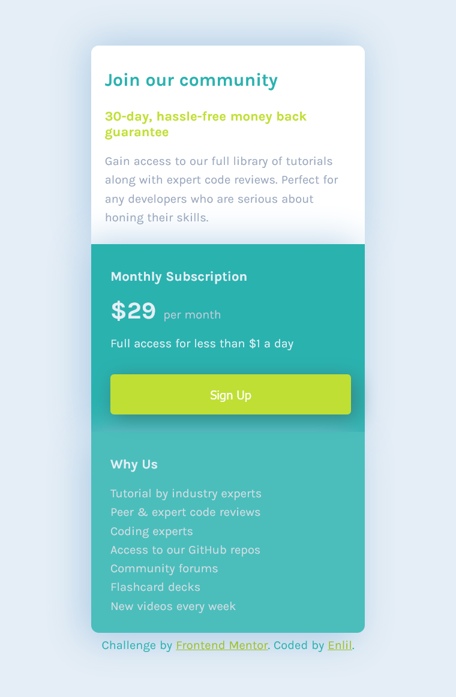

# Frontend Mentor - Single price grid component solution

This is [my](https://github.com/Nunamniroi) solution to the [Single price grid component challenge on Frontend Mentor](https://www.frontendmentor.io/challenges/single-price-grid-component-5ce41129d0ff452fec5abbbc).

## Table of contents

- [Overview](#overview)
  - [The challenge](#the-challenge)
  - [Screenshot](#screenshot)
  - [Links](#links)
- [My process](#my-process)
  - [Built with](#built-with)
  - [What I learned](#what-i-learned)
  - [Continued development](#continued-development)
- [Acknowledgments](#acknowledgments)

## Overview

### The challenge

Users should be able to:

- View the optimal layout for the component depending on their device's screen size
- See a hover state on desktop for the Sign Up call-to-action

### Screenshot

**1. Optimal layout for the component depending on their device's screen size**

- **Desktop Design**
  

- **Mobile design**
  

**2. Sign Up button states**

- **Sign Up disabled**
  

- **Sign Up hovered**
  

- **Sign Up focused**
  

### Links

- Solution URL: [Solution URL](https://github.com/Nunamniroi/Nunamniroi.github.io)
- Live Site URL: [Live Site URL](https://nunamniroi.github.io/)

## My process

### Built with

- Semantic HTML5 markup
- CSS custom properties
- Flexbox
- CSS Grid
- Mobile-first workflow

### What I learned

I have tagged the header, article and footer html code for better readability.

```html
<header>
  <h1>Join our community</h1>
  ...
</header>
```

```html
<article>
  <section>...</section>
</article>
```

```html
<footer>
  <p class="attribution">Challenge by</p>
  ...
</footer>
```

This part of code is for responsive design.

```css
@media screen and (min-width: 565px) {
  section {
    display: flex;
  }

  .left {
    flex: 1;
  }

  .right {
    flex: 1;
  }
}
```

### Continued development

In the future, I would like to add more functionality to the page, make a navigation menu from the right column "Why Us" and make a registration window when clicking on the button.

## Acknowledgments

Hope you liked my solution).
